# Hi, I'm Radoan Moktaken Jaman 👋

### CSE Undergraduate | Software Development | Cybersecurity | DSA & Competitive Programming

I'm a Computer Science student interested in **software development, cybersecurity, data structures & algorithms, and emerging technologies**.

I learn by **building projects, solving programming problems, participating in CTF competitions, and exploring new technologies**.

---

## 🛠️ Tech Stack

### Languages

  
  
  
  
  
  
  
  
  

### Tools & Technologies

  
  
  
  
  
  
  
  
  
  
  
  
  
  
  

### Interests

`Data Structures & Algorithms` ·
`Competitive Programming` ·
`Cybersecurity` ·
`CTF` ·
`Software Engineering` ·
`AI / ML`

---

## 📊 GitHub Stats

  
  

---

## 🔥 Contributions & Achievements

  
  

---

## 🎯 Currently Learning

- Data Structures & Algorithms
- Competitive Programming
- Software Development
- Cybersecurity & CTF
- Git & GitHub
- Artificial Intelligence & Machine Learning

---

## 🌐 Connect With Me

  
  
  
  
  

---

  <i>Learning → Building → Solving → Improving</i>

## 🐍 Contribution Graph

  <picture>
    <source
      media="(prefers-color-scheme: dark)"
      srcset="https://raw.githubusercontent.com/radoanjaman/radoanjaman/snake-output/snake-dark.svg"
    />
    <source
      media="(prefers-color-scheme: light)"
      srcset="https://raw.githubusercontent.com/radoanjaman/radoanjaman/snake-output/snake.svg"
    />
    
  </picture>

---

  

